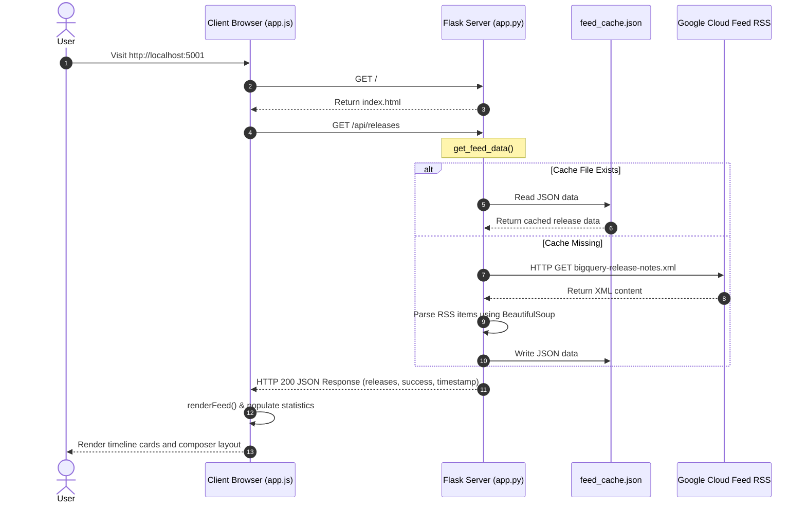

# BigQuery Release Pulse - Developer Dashboard

BigQuery Release Pulse is a modern developer dashboard built using Python Flask and plain vanilla HTML, CSS, and JavaScript. It aggregates the official Google Cloud BigQuery Release Notes RSS/Atom feed, parses the individual updates, and displays them in a clean, glassmorphic timeline layout. The application includes a smart, character-limit-safe Twitter integration for sharing select updates.

## 🚀 Key Features

* **Feed Categorization & Parsing**: Extracts HTML structures locked inside CDATA tags and splits updates into individual, color-coded item categories (Features, Changes, Issues, Deprecations).
* **Caching Layer**: Saves parsed feed data to a local `feed_cache.json` file, protecting the application from rate limits and providing instantaneous load times.
* **Instant Filtering & Searching**: Supports real-time client-side keyword searching across dates, type labels, or descriptions, plus tag filtering.
* **Dynamic Refresh**: Simple synchronization button with spinner indicators to force-refresh and pull the newest feed updates asynchronously.
* **Integrated Tweet Composer**: Composer drawer that automatically shortens and structures chosen release updates to fit within Twitter's 280-character limit, using official Web Intents for authentication-free posting.
* **Rich Glassmorphism Styling**: Sleek, modern developer-oriented UI styled with CSS gradients, glowing ambient background orbs, responsive layouts, and shimmer loading skeletons.

---

## 🛠️ Tech Stack

* **Backend**: Python 3, Flask, Requests, BeautifulSoup4
* **Frontend**: Vanilla HTML5, Vanilla CSS3 (Custom Variables, CSS Flexbox & Grid), Vanilla ES6 JavaScript
* **Assets & Fonts**: FontAwesome Icons, Google Fonts (Outfit & Plus Jakarta Sans)

---

## 📁 Project Structure

```text
├── app.py                 # Main Flask server, API handlers, XML Atom parser & caching engine
├── requirements.txt       # Project dependencies (Flask, requests, beautifulsoup4)
├── feed_cache.json        # Automatically generated local JSON cache for release notes
├── templates/
│   └── index.html         # Frontend HTML structure
├── static/
│   ├── css/
│   │   └── styles.css     # Premium dark-theme styling, glassmorphism layout, and keyframe animations
│   └── js/
│       └── app.js         # Client-side state manager, DOM renderer, filters, and Tweet composer
└── .gitignore             # Configured git excludes (caching files, virtual envs, scratch logs)
```

---

## 💻 Local Installation & Setup

Follow these steps to run the application locally on your computer:

### Prerequisites
Make sure you have Python 3 installed on your system.

### 1. Clone the repository
```bash
git clone https://github.com/ramshackleradio/antigravity-event-talks-app.git
cd antigravity-event-talks-app
```

### 2. Set up a Virtual Environment
Create and activate a isolated Python virtual environment:
```bash
# Create virtual environment
python3 -m venv venv

# Activate on macOS/Linux
source venv/bin/activate

# Activate on Windows
venv\Scripts\activate
```

### 3. Install Dependencies
```bash
pip install -r requirements.txt
```

### 4. Run the Server
Launch the Flask development server:
```bash
python3 app.py
```

By default, the server will fetch the latest feed contents, save it into `feed_cache.json`, and start running at:
👉 **[http://localhost:5001](http://localhost:5001)**

---

## 🔄 Request-Response Flow Walkthrough


